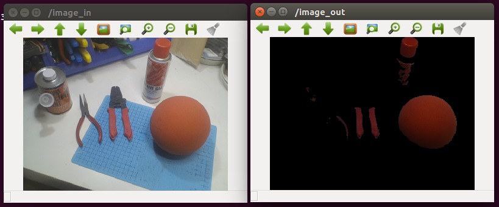

# OpenGL Simple GLSL Shader ROS Package
This is a ROS package for providing simple implementation to utilize OpenGL shader (GLSL) code 
with a GPU-powered machine under ROS environment, including 
a simple class that retrieves OpenCV image as a texture, processing with GLSL shader codes, 
and write it back to an OpenCV image.



## How to build?

### Setup ROS 
See http://wiki.ros.org/Installation and also setup catkin tools with the command below.

```
sudo apt install catkin-tools
```

### Setup catkin workspace
```
mkdir -P ~/catkin/src
cd ~/catkin
catkin init
```
### Clone this repository
```
cd ~/catkin/src
git clone <repository_path>
```

### Install prerequisite packages
Install usb_cam node for example applications.
```
sudo apt-get install ros-kinetic-usb-cam
```

### Build
```
catkin build
```

## Run example nodes
This repository includes example nodes that extract pixels with a specific color.
The algorithms of color conversion and extraction are implemented in GLSL shader code.

```
roslaunch opengl_ros color_extraction_gpu.launch
```

You can also launch a CPU implementation version for performance comparison 
with the following command.
```
roslaunch opengl_ros color_extraction_cpu.launch
```

We have perfomed simple comparison of the performance of two nodes on Intel Core i5 5300U 2.3GHz (HD Graphics 5500).
Execution time of GPU includes texture transmission between CPU and GPU.

| Resolution | CPU     | GPU     |
|------------|---------|---------|
| 320x240    | 5.85 ms | 1.25 ms |
| 640x480    | 21.8 ms | 4.30 ms |
| 1280x720   | 60.0 ms | 12.3 ms |

## A simple instruction for OpenGL renderer class

`cgs::SimpleRenderer` class in `opengl_ros_lib` package wraps everything for ease of use.
You can just instantiate the class, 

```
cgs::SimpleRenderer renderer(
    width, height, 
    vertexShader, fragmentShader
);
```

and call `render` method to perform rendering on an OpenCV image. 
`vertexShader` and `fragmentShader` arguments can take your own custom shaders.

```
//Get pointer of the image in the message.
auto cv_ptr = cv_bridge::toCvShare(msg, sensor_msgs::image_encodings::BGR8);

//Feed the image to the shader and render on the output image.
cv::Mat output(height, width, CV_8UC3);
renderer_->render(output_, cv_ptr->image);
```

Please look inside `simple_renderer_nodecore.cpp` for the reference of usage.

